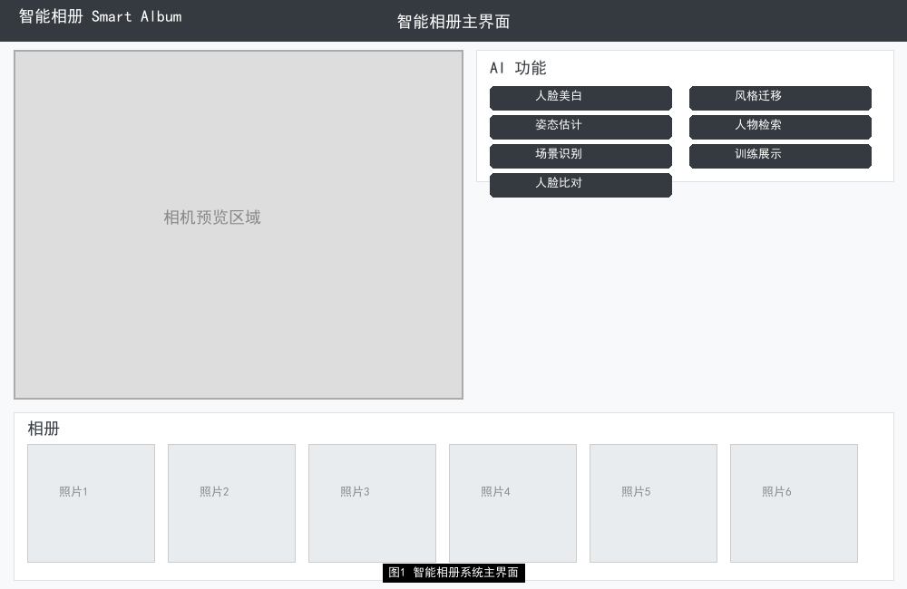
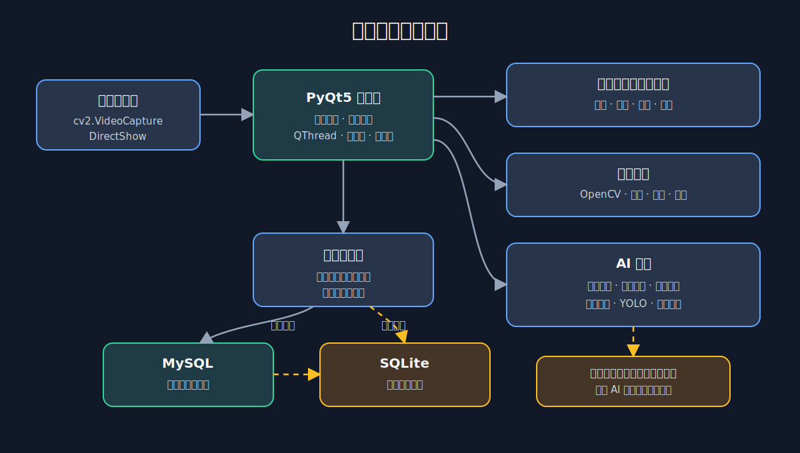
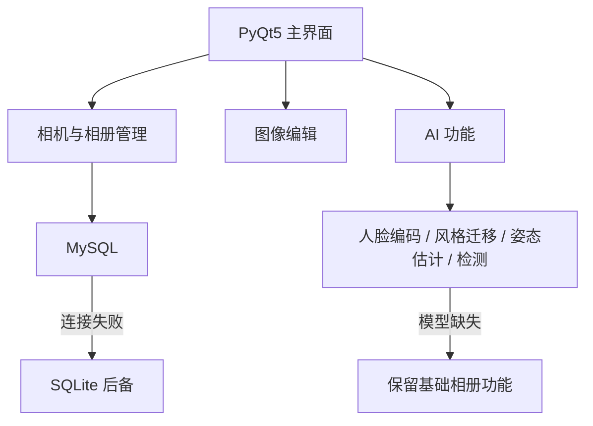

# Smart Album CV

一个基于 PyQt5、OpenCV 与 PyTorch 的桌面智能相册原型，展示相机采集、图片管理、视觉算法集成和本地数据降级能力。



## 项目亮点

- 使用 `QThread`、信号槽与线程池拆分相机采集、AI 推理和 UI 更新，降低主界面阻塞。
- 实现拍照、相册浏览、基础编辑、视频生成等桌面功能。
- 集成 Siamese Network + Contrastive Loss 的 128 维人脸编码模块。
- 集成 VGG19 + Gram 矩阵风格迁移、姿态估计、笑脸检测和 YOLO 推理接口。
- 数据层优先连接 MySQL，失败时自动切换本地 SQLite，基础相册功能仍可使用。
- 外部模型不可用时采用明确的降级路径，不让可选 AI 功能阻断主流程。

## 架构





## 快速开始

```powershell
python -m venv .venv
.\.venv\Scripts\Activate.ps1
pip install -r requirements.txt
python main.py
```

没有 MySQL 时，程序会尝试使用项目目录下的 SQLite 数据库。摄像头、模型文件和部分可选依赖缺失时，对应功能可能不可用。

如需使用 MySQL，请参考 `.env.example` 设置系统环境变量；不要把数据库密码提交到仓库。

## 代码入口

| 文件 | 作用 |
|---|---|
| `main.py` | PyQt5 主界面、相机、相册和数据库降级 |
| `face_verification.py` | Siamese 人脸编码与对比损失 |
| `style_transfer.py` | VGG19 风格迁移 |
| `pose_estimation.py` | 姿态估计 |
| `emotion_classification.py` | 表情分类 |
| `yolov10_inference.py` | YOLO 推理接口 |
| `gesture_control.py` | 手势控制 |
| `video_maker.py` | 图片视频生成 |

## 已验证与限制

- 已从原课程项目中抽取可公开源码与无个人数据的说明图。
- 已核验 QThread、Siamese Network、MySQL/SQLite 后备等代码证据。
- 仓库不包含个人照片、数据库、课程文档、编译产物和模型权重。
- 原始训练记录中存在不可作为有效精度证明的结果，因此不在 README 或简历中宣称模型准确率。
- `main.py` 仍是较大的桌面原型入口；当前优先保证项目可读和证据真实，后续可再按界面、数据层和算法模块拆分。

## 简历对应能力

该项目用于展示：桌面应用工程、线程与 UI 解耦、计算机视觉算法集成、数据库故障降级和本地应用可用性设计。
